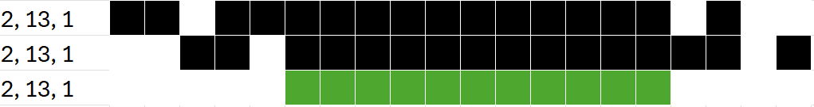
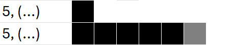
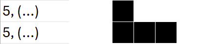
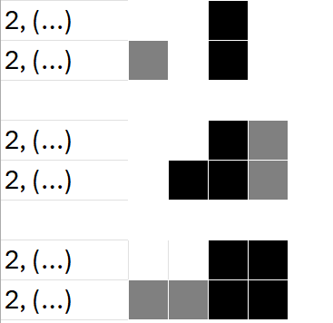
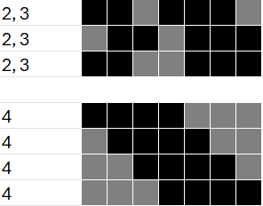
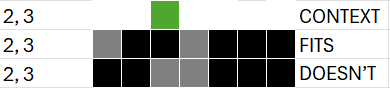

# Definitions:

## Input:
>m number of columns

>n number of rows

>a vector of integers per each row and column that where each integer represents the number of concurrent marked blocks in that same order

## Output:
>m*n matrix of bool elements stating which elements are marked and not.

These matrixes will be denoted as **Working** matrixes. To implement these matrixes, we will be holding two boolean variables per each cell. as such, in reality a 2*2 matrix will be a 2 row 4 column matrix.

thus:
|Cell|Meaning|
| ----------- | ----------- |
|00|Not marked/blank|
|01|Marked grey|
|10|Marked black|
|11|Contradiction|

## Nonogram Problems:
When researchers describe nonograms as being NP-Complete, they describe the Solvability or Existence problem. Citing R.A. Oosterman,et.al 2007, the problems surrounding nonograms are three:

>1. Existence: given a Nonogram N, does there exist a solution. In other words, is this Nonogram solvable?
>2. Solving: given a solvable Nonogram N, how can we obtain a solution?
>3. Uniqueness: given a solution for a Nonogram N, does there exist another solution?

## Scope:

The scope of this work/project is to solve the SECOND problem, the SOLVING problem as defined above. In other words, obtaining a solution given a solvable Nonogram N.

I ensure the nonogram is solvable, by first producing a complete nonogram and then obtaining its input and not using/deleting the solution nonogram, reconstructing the solution from exclusively the input (see input above). 

The first and second problem could have overlap in its solving methods, and a fully accurate solution to the second problem could potentially solve the first problem if it simply does not find a solution. However, the third problem is completely out of the scope of this project.

## Motivation:
so brute forcing this would take 
>O(2^(n*m)^)
very unefficient.

the goal is to optimize the solving sufficiently so that it takes a reasonable amount of time to solve a 1000x1000 puzzle and to see the solving process.

Thus, the main concern is optimization.

To do this multiple approaches will be tested and becnhmarked.

# Approaches
# Logic-Only:
This explains nonogram::solveLogicMethod() that wraps nonogram::mainLogic() and associated methods.

A heuristic process where all human-like solving methods are done obtaining the most amount of data the input gives us before any guessing is needed for.
each column and row is checked individually, forwards and backwards (whether that mean from left to right or from top to bottom or viceversa), for the subroutines below.
The amount of cells covered(marked as grey or black) by the process is noted before and after running one pass of the Logic-Only process, and is ran until there is no difference between pre-logic coverage and post-logic coverage percentages. 

Pseudocode for the main iteration can be described as:

    LogicOnly(nonogram)
    for each row and column i
        for each integer for the input vector of row/col i
            j = current index of integer of vector 
            preSubroutines()
            for each integer k in the input vector of row/col i from index start to j 
                Subroutines(i, j, k)
            preSubroutines()
            for each integer k in the input vector of row/col i from index end to j
                Subroutines(i, j, k)
            PostSubroutines(maxLeft, maxRight)

for Subroutines() and PostSubroutines(), extra parameters from preSubroutines exist but are not shown for simplicity

The space complexity of this algorithm (independent of nonogram-structures) is constant. 
The time complexity of this algorithm is polynomial.

## PreSubroutines
Allocates/resets boolean flags and two integers total (explained later).

## Subroutines:
Although documented as separate, these are closely implemented within the same main iteration described above, through help of PreSubroutines(). 

Subroutines constantly check to not be going out of bounds to prevent incurring in a segmentation fault or similar problems, this will be ommited from the explanations for simplicity.

### Simple Boxes:
What I consider the most important subroutine, based on that if you draw the run as compactly as possible to the left and afterwards draw the run as compactly as possible to the right, the overlaps for each individual black run or number must be filled in. see the following image:

in PreSubroutines() we create two integers, maxLeft and maxRight, we iterate through each black run in the input vector (above that would be {2, 13, 1}) and get to the maximum index we can reach for that run starting from the left and right. Going forward, when stating "iterating over a black run" it most probably means every instance of going through every integer in this vector and adding from maxRight or substracting from maxLeft.

for example, for 2 maxLeft we would add from zero until we get to 1 (careful of off by one errors) and maxRight would go from *number of cols*, substracting through 1, 13 and finally 2, leaving the minimum space inbetween (1), to obtain a maxRight of 2, because maxLeft is less than maxRight, there is no overlap and we dont mark anything, but normally we would simply mark from maxRight to maxLeft for that row.

this marking from maxRight to maxLeft is what happens in PostSubroutines

### Boolean flags
Before continuing with the subroutines, take these boolean flags into account 
*edge*: if we meet a blank cell, set to false. Resets to true

*edgemostInt*: if we finish iterating over a black run, and edge is false, set to false. Resets to true

### Edge Fill
An additional boolean flag, *edgeFilled* is allocated and set to false every iteration of the final for loops exactly before Subroutines() as shown in the pseudocode.

While iterating over a black run, if *edge* is true and *edgeFilled* is false and current cell being iterated through is a black cell: mark as black the rest of the black run and mark grey one cell after the end of the black run and *edgeFilled* is marked as true.

### Glue
While iterating over a black run, if *edgemostInt* and the current cell is marked black: mark as black the rest of the black run.

### Mercury 
after we finish iterating over a black run, if *edge* is false but *edgemostInt* is true, that is, all cells for previous black runs have been filled(either grey or black) check the next cell, and if its marked black, Mercury happens.

We check how many more black marked spaces exist next to the cell marked black that primed the mercury subroutine, and mark the same number of black contiguous cells found as grey starting from the edge. 
If we meet a grey cell while looking for said extra black marked spaces above we mark as black towards the opposite direction until we have the required number of contiguous black cells for that black run.

Let 2 be an edgemostInt, This image shows three cases, with each case having as the row above a possible input, and below the consequence of mercury. These cases simplify what is being achieved with Mercury. Take consideration of zero-based indexing in c++. 

In case one, after iterating through black run 2 and reaching index 1, we check the next index, 2, and find that it is filled, so Mercury is primed. We then check the next index, 3, and find that it is not black or grey so the number of black contiguous cells found is 1, as such we then mark from the edge, one contiguous grey cell, which would correspond from index 0 to index 0.

In case two, Mercury is primed, we then check the next index, 3, and it is grey, so we fill from index 2, two contiguous black cells (corresponding to the black run integer), that would correspond from index 2 to index 1. Afterwards, case one would still happen (not shown).

In case three, Mercury is primed, we check the next index, 3, and find that it is black so the number of black contiguous cells found is 2, we then check the next index, 4, and find that it is not black or grey so the final number of black contiguous cells found is 2. As such we then mark from the edge, two contiguous grey cells, which would correspond from index 0 to index 1.

# DFS:
## Determining all possibilities of a row:
The approach taken by Oosterman,et.al 2007 (once again) is:
>Find all possible combinations for a row or column. 
>Then filter out all of the candidate solutions that do not adhere to the description, based on the pixels that already have been given a known value.

This is done by using the permutationVector Custom class particularly specialized for this purpose. More on it in [permutationVector.h](./src/permutationVector.h). 
we do not store all possible combinations but rather iterate through permutation vector (treating it like a counting problem) and check this possibility to whether it adheres to cells (or pixels) already given a value

As you might suspect, this step by itself is NP-Complete.

## Pseudocode:

    DFS(uint rowIndex, bool solutionFound)
    if ( rowIndex >= (# of rows) )
        if(isSolution())
            solutionFound = true
        return;
    for each row possibility of rowIndex
        if( isPermutationPossible(rowIndex) )
            DFS( (rowIndex + 1), solutionFound)
            if(solutionFound)
                return;
            else
                clear rows from rowIndex to (# of rows - 1)

### Inorder-tree DFS traversal:
recursively traverse all possibilities treating the nonogram's possible rows as a node of a tree, with higher rows being parents of lower rows. 

When referring to Inorder, or saying "for each row possibility of *rowIndex* leftmost-row possibilities are checked first (where the current row possibility is as close to the "left"most edge), an example of this order is shown here:

### isPermutationPossible()
A row permutation fits if the context (current matrix) does not hold any black or grey cells wherever the row being checked does not have one. 

if the current rowPermutation fits, afterwards all column vector Inputs are checked to determine whether it is a possible column or not. all column's *colSum* are calculated to determine how many black marked cells are in that column in total and the *colMax* to determine which black run has the most amount of contiguously marked cells in that row.

pseudocode:

    isPermutationPossible(permutationVector rowPermutation, uint rowIndex )
        if rowPermutation fits in rowIndex
            matrix[rowIndex] = rowPermutation
            if all columns are possible:
                return true
            else:
                return false
        else
            return false

### Inbetween logic and Contexts
The current rows and their contexts are now passed as parameters too. 

pseudocode:

    DFS(rowContexts, rowvectors, uint rowIndex, bool solutionFound)
    if ( rowIndex >= (# of rows) )
        if(isSolution())
            solutionFound = true
        return;
    for each row possibility of rowIndex
        if( isPermutationPossible(rowContexts, rowvectors, rowIndex) )
            DFS(rowvectors, (rowIndex + 1), solutionFound)
            if(solutionFound)
                return;
            else
                if size(rowContexts) > 0
                    rowContexts.pop_back() - remove last vector added
                rowvectors.pop_back() - remove last vector added

    isPermutationPossible(rowContexts, rowVectors, permutationVector rowPermutation, uint rowIndex )
        for integer i from 0 to rowIndex - 1
            DFSWorkingMatrix [i] = rowVectors[i]
        if size(rowContexts) > 0
            DFSWorkingMatrix[rowIndex] = last element of rowContexts
        for the rest of the rows
            DFSWorkingMatrix [i] = nonoWorkingMatrix[i] 
        if rowPermutation does not fit in rowContexts[rowIndex]
            return false
        DFSWorkingMatrix[rowIndex] = rowPermutation
        if all columns are not possible:
            return false
        try{ SolveLogicMethod(DFSWorkingMatrix) }
        catch{
            return false
        }
        if all columns are not possible:
            return false
        append rowPermutation to rowVectors
        if(rowIndex + 1 < rows)
            append DFSWorkingMatrix[rowIndex+1] to rowContexts
        return true

### Data structures
rowVectors and rowContexts are implemented as a vector of vectors (forming a matrix) but future optimizations could use a lighter data structure such as a linked list (of vectors anyway), considering its current use as shown. 

# About nonogram tournaments
https://content.iospress.com/articles/icga-journal/icg230216

an ambitious goal would be to outperform them. 

# LalaFrogKK
...An Efficient Approach to Solving Nonograms
I.-Chen Wu, Member, IEEE, Der-Johng Sun, Lung-Ping Chen, Kan-Yueh Chen, Ching-Hua Kuo,Hao-Hua Kang, and Hung-Hsuan Lin

# Requiem
https://content.iospress.com/articles/icga-journal/icg190097
hard paywall I'm guessing. they say theye expand on "Wu", which is LaLaFrogKK above or another unmentioned, "Naughty"

reading all these codenames really does make it sound cool 

## Considerations:
Memory was kept limited, for this specific method memory complexity is polynomial.
another nonogram bool matrix was added, thus making the nonogram object in itself heavier in memory even if only using the Logic-Only methods.

My method was a fun project and a good learning experience, but the truth of the matter is my approaches can only seem to solve up to nonograms size 20x20 - 30x30 depending on how hard the nonogram input is. 

So plan is now to read understand and implement in this solver approaches:

LalaFrogKK winner of nonogram tournaments
and Requiem, most current winner of nongram tournament found

these are made by asian authors and as such language barriers might be a big problem, but I already expected such things when looking over the research papers and given the asian origins of nonograms themselves

solid data here:
https://kcwu.csie.org/~kcwu/nonogram/taai11/

